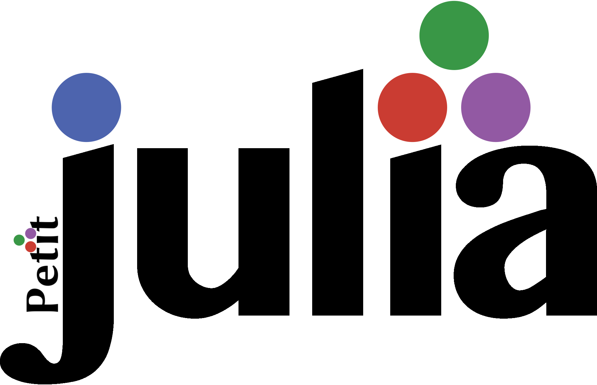

## Dependencies
- `OCaml` to compile OCaml code.
- `Menhir` to generate the parser.
- `OCamllex` to generate the lexer.
- `ppx_deriving` to derive printers from types.
- `dune` to compile.
## Usage
- `make`: Compile and run `tests/test.jl`
- `make clean`: Clean compilation files.
